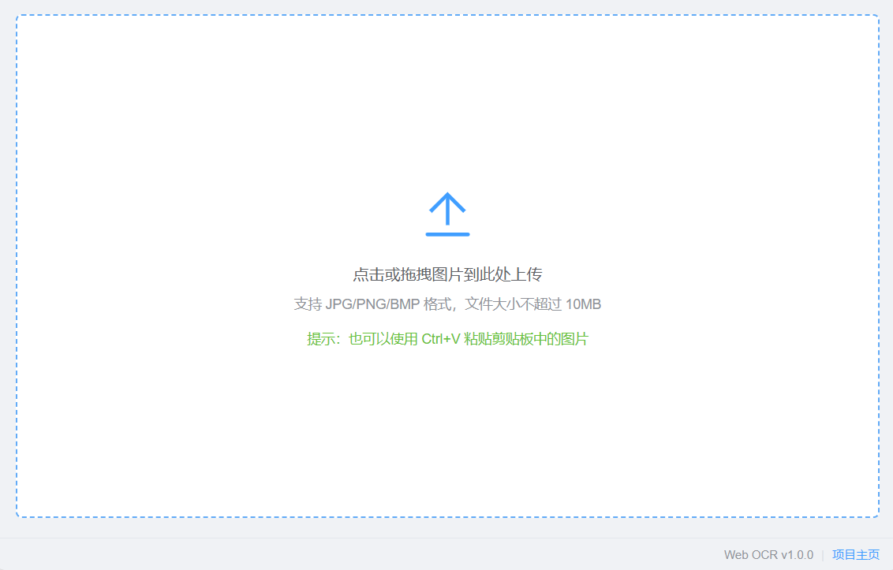
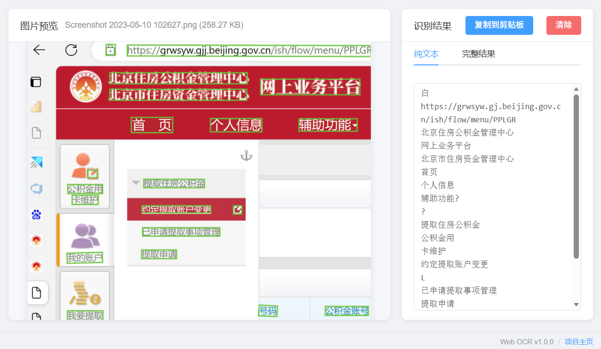
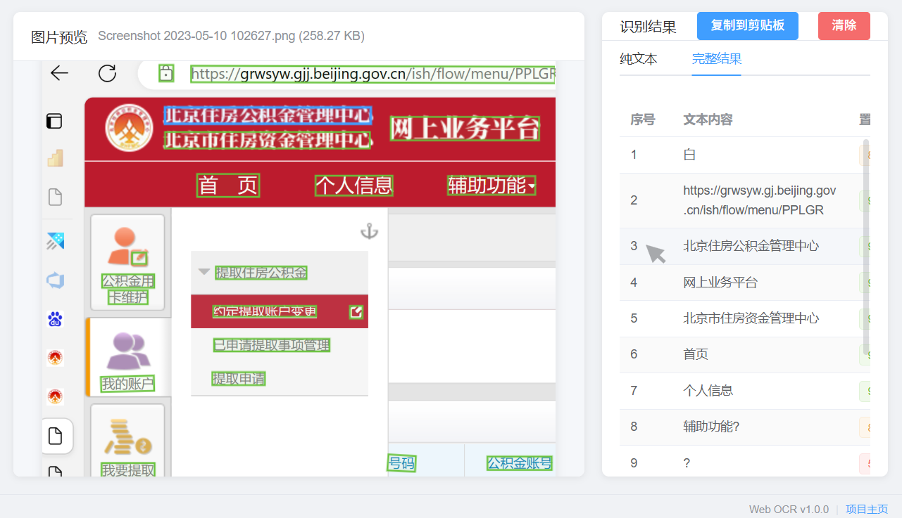

# Web OCR 使用手册

欢迎使用 Web OCR 图片文字识别系统！本手册将帮助您快速上手，轻松完成图片文字识别任务。

---

## 📋 目录

1. [快速开始](#快速开始)
2. [上传图片](#上传图片)
3. [查看识别结果](#查看识别结果)
4. [复制和导出](#复制和导出)
5. [常见问题](#常见问题)

---

## 🚀 快速开始

### 访问系统

打开浏览器，访问 Web OCR 系统。您将看到简洁的上传界面：



### 三步完成识别

1. **上传图片** - 选择您要识别的图片
2. **等待处理** - 系统自动识别图片中的文字
3. **查看结果** - 获取识别文本，支持复制和导出

---

## 📤 上传图片

Web OCR 支持三种便捷的上传方式，选择最适合您的方式：

### 方式一：点击选择文件

1. 点击上传区域的任意位置
2. 在弹出的文件选择对话框中，选择要识别的图片
3. 点击"打开"按钮

> **💡 提示**：系统会自动显示确认对话框，预览图片信息

### 方式二：拖拽上传

1. 在电脑中找到要识别的图片文件
2. 将图片文件拖拽到上传区域
3. 松开鼠标即可

> **💡 提示**：拖拽时，上传区域会高亮显示，表示可以放置

### 方式三：粘贴上传 ⌨️

1. 复制图片到剪贴板（例如：在其他软件中右键复制图片）
2. 在 Web OCR 页面上，按下 `Ctrl+V`（Windows）或 `Cmd+V`（Mac）
3. 系统自动检测并上传剪贴板中的图片

> **💡 提示**：这是最快捷的方式，特别适合从截图工具或其他应用粘贴

### 确认上传

选择图片后，系统会弹出确认对话框：

- **预览图片**：查看即将识别的图片
- **文件信息**：显示文件名和大小
- **操作按钮**：
  - 点击"**开始识别**"按钮（蓝色）确认上传
  - 点击"**取消**"按钮重新选择

> **⚠️ 注意**：确认对话框打开后，可以按 `Enter` 键快速开始识别，或按 `Esc` 键取消

### 支持的格式

- ✅ **JPG/JPEG** - 最常见的图片格式
- ✅ **PNG** - 支持透明背景
- ✅ **BMP** - 位图格式

### 文件大小限制

- 📏 单个文件最大 **10MB**
- 建议使用清晰、文字清晰可见的图片以获得最佳识别效果

---

## 🔍 查看识别结果

上传图片后，系统会自动开始识别。识别过程中会显示进度提示：

1. "正在准备图片..." - 图片处理中
2. "正在识别中，请稍候..." - OCR 识别中

### 识别完成

识别完成后，页面会自动切换为结果展示界面：



界面分为两个部分：

#### 左侧：图片预览区

- **图片显示**：展示原始上传的图片
- **文件信息**：显示文件名和大小
- **边界框标注**：绿色框标注识别到的文本区域
- **缩放预览**：点击图片可以放大查看细节

> **💡 提示**：可以使用鼠标滚轮缩放，拖拽平移查看大图

#### 右侧：识别结果区

提供两种查看模式，通过顶部标签切换：

---

### 📝 纯文本模式

**特点**：简洁直观，快速获取识别文字

- 显示所有识别到的文本内容
- 保持原文的换行和顺序
- 适合快速浏览和复制

**使用场景**：
- 只需要文字内容，不关心位置信息
- 需要快速复制到其他应用
- 文档整理、笔记记录

---

### 📊 完整结果模式

**特点**：详细展示，包含位置和置信度信息

表格列说明：
- **序号**：文本行的顺序编号
- **文本内容**：识别到的具体文字
- **置信度**：识别准确性的评分（0-100%）

#### 置信度标识

系统使用颜色标签直观展示识别准确度：

- 🟢 **绿色**（≥90%）：识别非常准确，可以放心使用
- 🟡 **黄色**（70%-90%）：识别较准确，建议检查
- 🔴 **红色**（<70%）：识别不太准确，需要人工校对

> **💡 提示**：如果看到红色或黄色标签，建议对照原图检查对应文字

#### 交互式高亮 ✨

**完整结果模式**的特色功能：

1. 将鼠标悬停在表格的任意一行
2. 左侧图片中对应的文本区域会**高亮显示**（蓝色边框）
3. 移开鼠标，高亮消失



**使用场景**：
- 检查某段文字是否识别正确
- 查找特定文字在图片中的位置
- 对比识别结果与原图

---

## 📋 复制和导出

### 一键复制

识别完成后，点击右上角的"**复制到剪贴板**"按钮即可复制内容：

#### 纯文本模式
- 复制内容：识别的纯文本
- 用途：粘贴到 Word、记事本、邮件等

#### 完整结果模式
- 复制内容：JSON 格式的详细数据
- 包含：文本内容、置信度、坐标位置
- 用途：程序开发、数据分析、二次处理

**JSON 格式示例**：
```json
[
  {
    "text": "识别的文本",
    "confidence": 0.9876,
    "box": [[x1,y1], [x2,y2], [x3,y3], [x4,y4]]
  }
]
```

### 手动复制

您也可以直接选中文本内容，使用 `Ctrl+C`（Windows）或 `Cmd+C`（Mac）复制。

---

## 🔄 清除和重新识别

### 清除当前结果

如果需要识别新的图片：

1. 点击右上角的"**清除**"按钮（红色）
2. 在弹出的确认对话框中，点击"**是**"
3. 页面返回上传界面

> **💡 提示**：确认对话框默认选中"否"，避免误操作

### 继续识别

清除后，您可以重新上传新的图片进行识别。

---

## ❓ 常见问题

### 1. 上传图片后没有反应？

**可能原因**：
- 文件格式不支持（仅支持 JPG/PNG/BMP）
- 文件大小超过 10MB
- 网络连接问题

**解决方法**：
- 检查文件格式和大小
- 刷新页面重试
- 检查浏览器控制台是否有错误提示

---

### 2. 识别结果不准确怎么办？

**提升识别准确率的建议**：
- ✅ 使用清晰、高分辨率的图片
- ✅ 确保文字清晰可见，避免模糊
- ✅ 图片光线充足，对比度高
- ✅ 文字排列整齐，避免严重倾斜
- ❌ 避免使用过度压缩的图片
- ❌ 避免水印遮挡文字区域

**特殊情况**：
- 手写字识别准确率较低
- 艺术字体可能识别困难
- 竖排文字可能需要手动调整

---

### 3. 可以批量识别多张图片吗？

目前版本暂不支持批量识别，每次只能上传一张图片。

**建议操作流程**：
1. 识别第一张图片
2. 复制结果并保存
3. 点击"清除"
4. 上传下一张图片

> **💡 提示**：批量识别功能已列入开发计划

---

### 4. 识别速度慢怎么办？

**影响速度的因素**：
- 图片大小（大图片处理时间更长）
- 文字数量（文字越多，识别时间越长）
- 服务器负载（高峰期可能较慢）
- 网络速度

**优化建议**：
- 裁剪掉图片中不需要识别的区域
- 适当降低图片分辨率（保持文字清晰即可）
- 避免在高峰期使用

**正常识别时间**：
- 小图片（<1MB）：3-5 秒
- 中等图片（1-3MB）：5-10 秒
- 大图片（3-10MB）：10-20 秒

---

### 5. 识别结果可以保存吗？

目前系统不提供自动保存功能，建议手动保存：

**方法一：复制文本**
1. 点击"复制到剪贴板"按钮
2. 粘贴到 Word、记事本等应用
3. 保存文件

**方法二：截图保存**
- 对结果区域截图保存
- 保留原图和识别结果的对照

> **💡 提示**：结果导出功能已列入开发计划

---

### 6. 支持哪些语言？

**当前支持**：
- ✅ 中文（简体）
- ✅ 英文
- ✅ 中英文混合

**暂不支持**：
- ❌ 繁体中文
- ❌ 日文、韩文
- ❌ 其他小语种

> **💡 提示**：多语言支持已列入开发计划

---

### 7. 数据安全吗？

**隐私保护**：
- ✅ 图片仅用于识别，不会存储
- ✅ 识别结果仅在您的浏览器中显示
- ✅ 刷新页面后，所有数据清除
- ✅ 不会收集或保存您的任何信息

**建议**：
- 不要上传包含敏感信息的图片（身份证、银行卡等）
- 识别完成后及时清除结果

---

## 💡 使用技巧

### 快捷键

- `Ctrl+V` / `Cmd+V`：粘贴图片快速上传
- `Enter`：在确认对话框中快速开始识别
- `Esc`：关闭对话框

### 最佳实践

1. **图片准备**
   - 拍照时保持手机稳定，避免模糊
   - 确保充足光线，文字清晰
   - 正面拍摄，避免过度倾斜

2. **识别检查**
   - 使用"完整结果"模式查看置信度
   - 对黄色、红色标签的内容重点检查
   - 使用高亮功能对照原图验证

3. **结果整理**
   - 及时复制保存识别结果
   - 对于重要文档，建议人工校对
   - 保留原图备用

---

## 📞 获取帮助

如果在使用过程中遇到问题：

1. 查看本使用手册的[常见问题](#常见问题)章节
2. 访问[项目主页](https://github.com/hwuu/webocr)查看更多信息
3. 在 GitHub 上[提交 Issue](https://github.com/hwuu/webocr/issues) 反馈问题

---

## 🎉 开始使用

现在您已经了解了 Web OCR 的所有功能，赶快试试吧！

**记住三步走**：
1. 📤 上传图片（点击/拖拽/粘贴）
2. ⏱️ 等待识别（3-20秒）
3. 📋 查看并复制结果

祝您使用愉快！ 🚀
